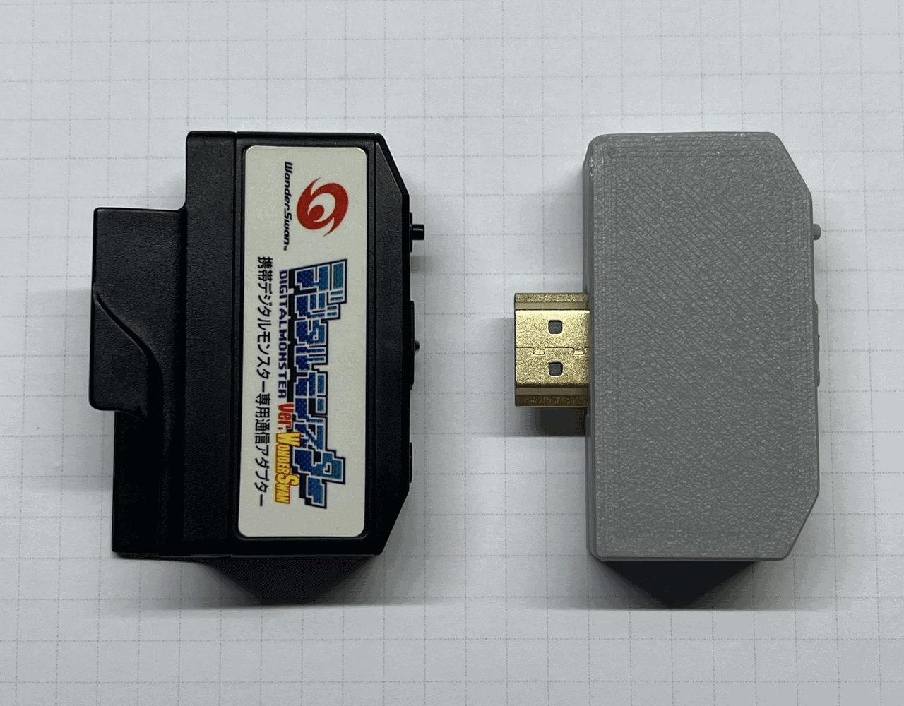
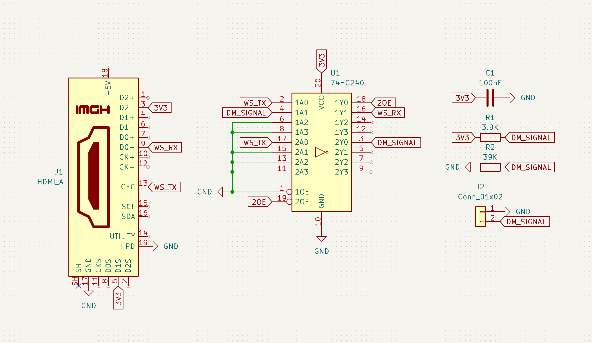
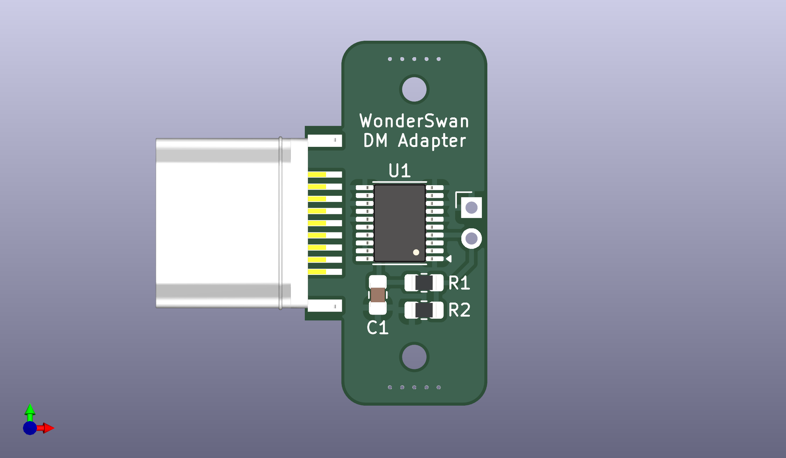
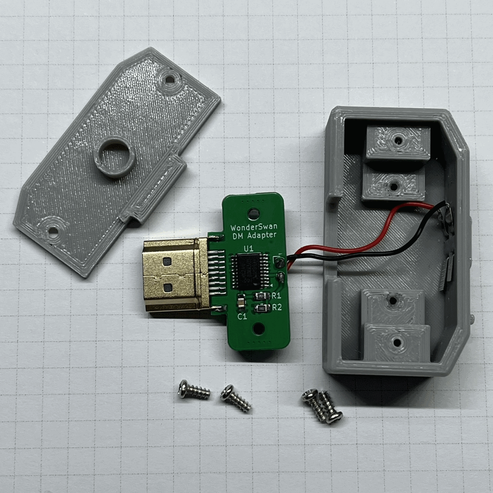
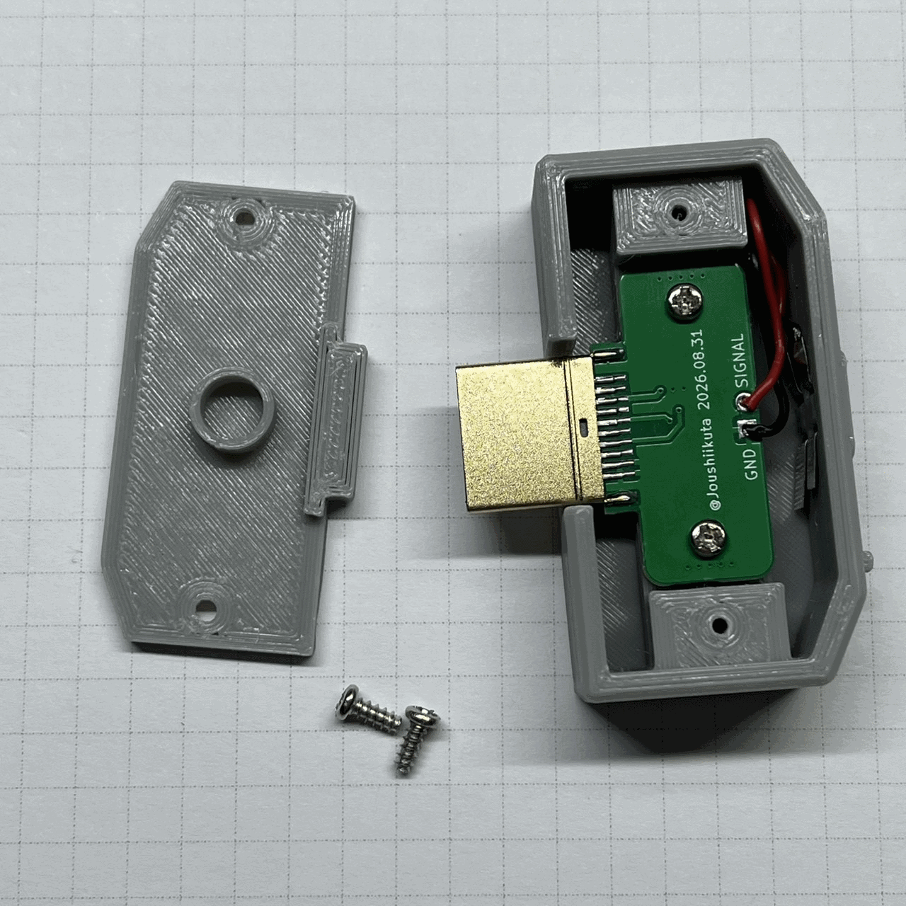
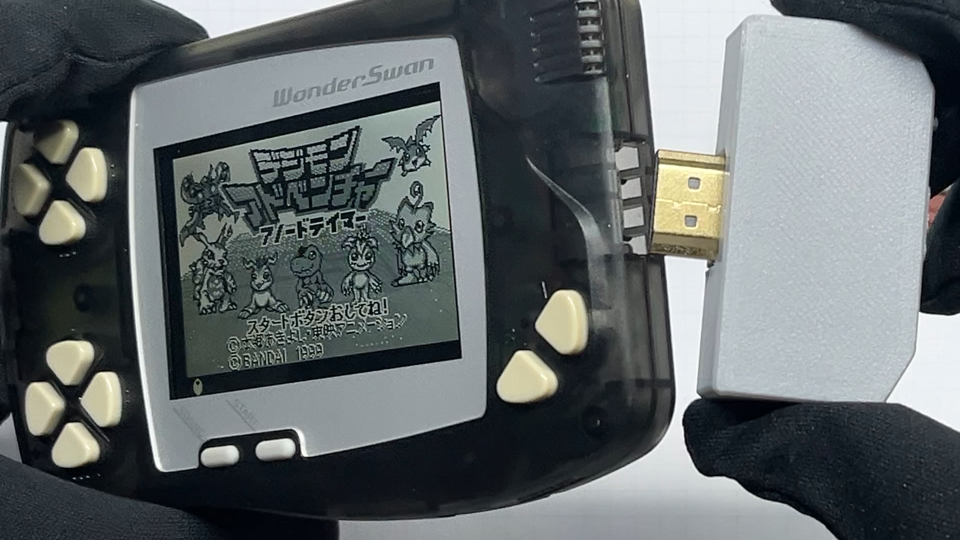

## WonderSwan-Digimon-Adapter
A WonderSwan Battle Adapter for 2-prong Digimon devices, built with the 74HC240PW.

https://www.youtube.com/watch?v=fErAgkqEu_E

## Schematic

## PCB

| **Reference** | **Part** |
-|-|
|U1 |74HC240PW|
|R1 |0805 SMD Resistor 3.9kΩ|
|R2 |0805 SMD Resistor 39kΩ|
|C1 |0805 SMD Capacitor 0.1µF|
|J1 |HDMI Male Connector 19Pin|

00_Gerber_WS_DM_Adapter.zip — Contains the Gerber files for the PCB.

PCB thickness: 1.6mm

## 3D Printing Models
01_WS_DM_Adapter_Top.stl

02_WS_DM_Adapter_Bottom.stl

https://www.thingiverse.com/thing:7411938
## Other Parts
M2x5 Self-tapping Screw

Nickel plated steel strip (Thick:0.1mm Wide:3mm) 

Wires

## Wiring

## Notes
Devices released after 2026 may not be supported.

The opening is larger than the connector, so make sure to insert the HDMI male connector along the bottom edge of the opening.

